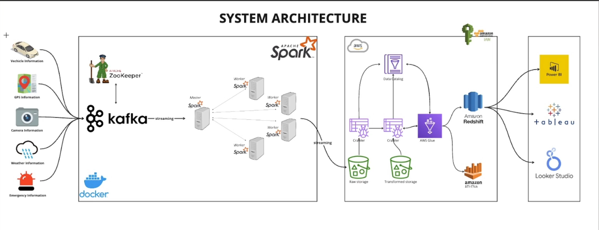

# 🚦 Smart City Real-Time Streaming Data Platform

## 📌 Overview

This project demonstrates a modern **real-time data engineering pipeline** for a Smart City ecosystem using Apache Kafka, Apache Spark Structured Streaming, AWS S3, AWS Glue, and Amazon Athena.

The platform simulates multiple smart city data sources such as:

* Vehicle telemetry
* GPS tracking
* Traffic cameras
* Weather monitoring
* Emergency incidents

Streaming data is ingested into Kafka, processed in real time with Spark, stored as Parquet files in AWS S3, cataloged using AWS Glue, and queried through Amazon Athena.

---

# 🏗️ System Architecture



---

# ⚙️ Tech Stack

## Streaming & Processing

* Apache Kafka
* Apache Spark Structured Streaming
* Apache ZooKeeper

## Cloud & Data Lake

* AWS S3
* AWS Glue
* Amazon Athena

## Infrastructure

* Docker
* Docker Compose

## Programming Language

* Python

---

# 📂 Project Structure

```bash
smart-city/
│
├── config/
│   ├── settings.py
│   └── spark_config.py
│
├── docs/
│   └── PipeLine.png
│
├── jobs/
│   ├── main.py
│   └── spark-city.py
│
├── kafka/
│   └── producer.py
│
├── simulator/
│   ├── emergency_incident.py
│   ├── gps_data.py
│   ├── journey.py
│   ├── traffic_camera.py
│   ├── vehicle_data.py
│   └── weather_data.py
│
├── utils/
│   ├── data_cleaning.py
│   ├── data_quality.py
│   ├── logger.py
│   └── utils.py
│
├── docker-compose.yml
├── Dockerfile
├── requirements.txt
└── requirements.docker.txt
```

---

# 🔄 Data Pipeline Flow

```text
Simulated Smart City Data
        ↓
Apache Kafka Topics
        ↓
Spark Structured Streaming
        ↓
AWS S3 (Parquet Format)
        ↓
AWS Glue Crawler & Catalog
        ↓
Amazon Athena
        ↓
BI & Analytics Tools
```

---

# 📡 Kafka Topics

The platform streams data into multiple Kafka topics:

| Topic Name       | Description               |
| ---------------- | ------------------------- |
| `vehicle_data`   | Vehicle telemetry data    |
| `gps_data`       | GPS location tracking     |
| `traffic_data`   | Traffic camera events     |
| `weather_data`   | Weather monitoring data   |
| `emergency_data` | Emergency incident alerts |

---

# 🚀 Features

## Real-Time Streaming

* Continuous data ingestion using Kafka
* Spark Structured Streaming micro-batch processing

## Data Lake Architecture

* Raw streaming data stored in S3
* Parquet columnar storage format

## Metadata Management

* AWS Glue Crawler automatically catalogs datasets

## Query Engine

* SQL analytics using Amazon Athena

## Containerized Infrastructure

* Kafka, Spark Master, and Spark Workers managed with Docker Compose

---

# 🐳 Running the Project

## 1. Clone Repository

```bash
git clone <your-repository-url>
cd smart-city
```

---

## 2. Start Infrastructure

```bash
docker compose up -d
```

---

## 3. Verify Containers

```bash
docker ps
```

Expected containers:

* zookeeper
* broker
* spark-master
* spark-worker-1
* spark-worker-2

---

## 4. Run Data Producer

```bash
python -m jobs.main
```

---

## 5. Submit Spark Streaming Job

```bash
docker exec -it spark-master \
/opt/spark/bin/spark-submit \
--master spark://spark-master:7077 \
--packages org.apache.spark:spark-sql-kafka-0-10_2.12:3.5.2,org.apache.hadoop:hadoop-aws:3.3.4,com.amazonaws:aws-java-sdk-bundle:1.12.262 \
jobs/spark-city.py
```

---

# ☁️ AWS Services Integration

## AWS S3

Streaming parquet files are stored in:

```text
s3://02-smart-city/
```

## AWS Glue

Glue Crawlers automatically infer schema and create catalog tables.

## Amazon Athena

Athena is used to query streaming parquet datasets directly from S3.

Example query:

```sql
SELECT *
FROM smart_city_db.vehicle_data
LIMIT 10;
```

---

# 📊 Example Analytics Use Cases

* Traffic congestion monitoring
* Vehicle speed analysis
* Weather impact on traffic
* Emergency response tracking
* GPS movement analytics

---

# 📈 Future Improvements

* Apache Airflow orchestration
* Delta Lake / Apache Iceberg integration
* Real-time dashboards with Power BI or Tableau
* CI/CD pipeline deployment
* Data quality monitoring
* Partition optimization
* Streaming aggregation layer

---

# 🧠 Learning Outcomes

This project demonstrates practical experience with:

* Distributed streaming systems
* Real-time ETL pipelines
* Spark Structured Streaming
* Data Lake architecture
* AWS analytics ecosystem
* Dockerized distributed systems

---

# 👨‍💻 Author

**Thuấn Dao**

Data Engineering Project — Smart City Streaming Platform
